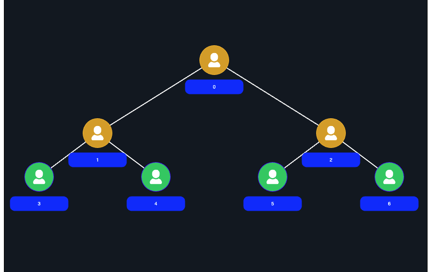

`import { BinaryTree } from "BinaryTree";`

### Basic example:

```plaintext

const canvas = document.getElementById("canvas");
const ctx = canvas.getContext("2d");
canvas.width = window.innerHeight - 100;
canvas.height = window.innerHeight - 100;
const centerX = canvas.height / 2;
const centerY = canvas.height / 2;

const tree = new BinaryTree(canvas, centerX, centerX, 0);


// add node with position id
tree.addNode(0);

// using when change node position
tree.draw();


```

### `node:`

```plaintext


export interface GNode {
  id: number;
  type?: "isAvailable" | "isLoading";
  x: number;
  y: number;
  minimized: boolean;
  isRoot?: boolean;
  style?: style;
}

```
